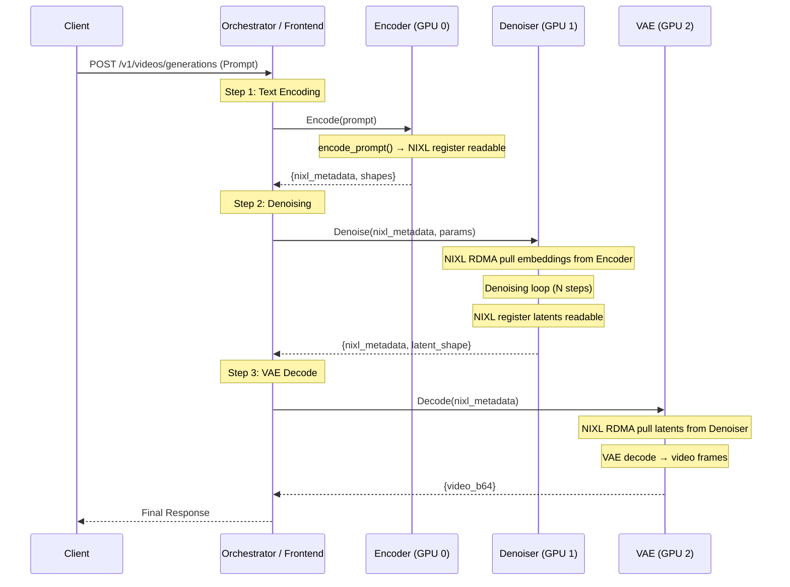

# Design Doc: Disaggregated Diffusion Inference (Diff-Disagg) in Dynamo

## 1. Motivation

Current diffusion inference in Dynamo (e.g., SGLang backend) is monolithic: a single worker loads all model components (Text Encoder, Transformer/UNet, VAE). This design faces several challenges with modern large-scale diffusion models (Flux, SD3, Video Models):

1.  **Huge Text Encoders**: Models like Flux use T5-XXL, consuming 10-20GB VRAM just for the encoder, which is only used once at the beginning.
2.  **Resource Inefficiency**: During the long denoising loop (20-50 steps), the text encoder weights occupy precious H100/H200 memory without being used.
3.  **Heterogeneous Compute**:
    *   **Text Encoding**: Compute-intensive, single pass. Can run on lower-end GPUs or even CPU.
    *   **Denoising**: Memory-bandwidth and compute-intensive, iterative. Requires high-end GPUs (H100/H200).
    *   **VAE Decoding**: Memory-intensive, single pass. Can be offloaded.

**Goal**: Decompose the diffusion pipeline into flexible, independent stages (Encoder, Denoiser, VAE) that can be deployed on different hardware and scaled independently.

## 2. Architecture

### 2.1 Orchestration Design Choice

Two candidate architectures were evaluated:

| | Centralized Orchestrator | Decoupled Message Queue |
|---|---|---|
| **Pattern** | Frontend/Router chains stages sequentially | Stages communicate via MQ (e.g., NATS/Kafka) |
| **Pros** | Smart routing (load-aware, affinity); full request lifecycle visibility; straightforward cancel/timeout; centralized metrics; easy to reason about ordering | Loose coupling; stages scale independently; easy to add/remove workers without coordinator change |
| **Cons** | Orchestrator is a bottleneck/SPOF; tighter coupling | Hard to implement cancel propagation; no global request view; ordering/retry complexity; harder to collect end-to-end metrics |

**Decision: Centralized Orchestrator** — the benefits of request lifecycle management, cancel support, and metrics observability outweigh the coupling cost. This aligns with Dynamo's existing Frontend/Router model for LLM disaggregation (EPD).

### 2.2 Component Roles

1.  **Orchestrator (Frontend / Router)**:
    *   Receives the initial user request.
    *   Orchestrates the sequence: `Encoder → Denoiser → VAE`.
    *   Owns the full request lifecycle: tracking, cancellation, metrics, timeout.
    *   Routes each stage to the best available worker instance.

2.  **Stage Workers**:
    *   **Encoder Worker**: Loads UMT5/CLIP+T5. Input: Text. Output: Embeddings via NIXL RDMA.
    *   **Denoiser Worker**: Loads Transformer/UNet. Input: Embeddings (NIXL). Output: Latents via NIXL RDMA.
    *   **VAE Worker**: Loads VAE. Input: Latents (NIXL). Output: Video/Image bytes.

### 2.3 Data Flow



**Key**: Tensor data (embeddings ~3.6 MB, latents ~1.4 MB) transfers GPU→GPU via NIXL RDMA. Only small metadata (~1.5 KB) travels through the orchestrator's RPC channel.

## 3. Detailed Design

### 3.1 Protocol Extensions (`dynamo/common/protocols`)

We need to define data structures for intermediate results.

**New Protocol Types:**

```python
class DiffusionEmbeddingData(BaseModel):
    """Output from Encoder Stage"""
    prompt_embeds: bytes          # Serialized Tensor (e.g., safetensors/numpy)
    pooled_prompt_embeds: Optional[bytes] = None
    negative_prompt_embeds: Optional[bytes] = None
    negative_pooled_prompt_embeds: Optional[bytes] = None

class DiffusionLatentData(BaseModel):
    """Output from Denoiser Stage"""
    latents: bytes                # Serialized Tensor
    shape: List[int]
    dtype: str

class StageRequest(BaseModel):
    """Generic Request for a specific stage"""
    stage: str                    # "encoder", "denoiser", "vae"
    input_data: Union[str, DiffusionEmbeddingData, DiffusionLatentData]
    params: Dict[str, Any]        # Generation params (steps, cfg, etc.)
```

### 3.2 ModelType Expansion (`dynamo/llm/src/model.rs` & Python Enums)

Extend `ModelType` to support fine-grained stages.

```python
class ModelType(IntFlag):
    # Existing
    Tokens = auto()
    # ...
    
    # New Diffusion Stages
    DiffusionEncoder = auto()  # Text Encoder only
    DiffusionDenoiser = auto() # Transformer/UNet only
    DiffusionVAE = auto()      # VAE only
```

### 3.3 SGLang Backend Adaptation (`components/src/dynamo/sglang`)

We need to modify `init_diffusion.py` and handlers to support partial loading.

**Configuration:**
Add `--diffusion-stage` argument to `sglang` worker.

*   `--diffusion-stage full` (Default): Loads everything (current behavior).
*   `--diffusion-stage encoder`: Loads only Text Encoders.
*   `--diffusion-stage denoiser`: Loads only Transformer, accepts Embeddings.
*   `--diffusion-stage vae`: Loads only VAE, accepts Latents.

**Handler Implementation:**

1.  **`EncoderHandler`**:
    *   Uses `pipe.encode_prompt()`.
    *   Returns serialized embeddings.

2.  **`DenoiserHandler`**:
    *   Initializes pipeline with `text_encoder=None`, `vae=None`.
    *   Implements `generate(prompt_embeds=...)`.
    *   Returns latents (skips VAE decode).

3.  **`VAEHandler`**:
    *   Initializes pipeline with `text_encoder=None`, `transformer=None`.
    *   Implements `decode(latents=...)`.

### 3.4 Router Logic (`components/src/dynamo/global_router`)

The Global Router needs to be aware of these new `ModelType`s.

*   **Registration**: Workers register with specific types (e.g., `ModelType.DiffusionEncoder`).
*   **Routing**:
    *   `handle_encoder_request`: Routes to Encoder Pool.
    *   `handle_denoiser_request`: Routes to Denoiser Pool.
    *   `handle_vae_request`: Routes to VAE Pool.

## 4. Implementation Plan

### POC (Proof of Concept)

Full POC code lives in [`examples/disagg_diffusion/`](../../examples/disagg_diffusion/).

#### Phase 0: Offline Validation (`phase0_validate/`)

Single-GPU script that proves diffusers supports split execution.
Runs Encoder → Denoiser → VAE as three separate stages with serialized
intermediate tensors, then compares the result against a monolithic run.

**Key risk validated**: Can diffusers pipelines accept `prompt_embeds` and
return `output_type="latent"` to bypass text encoder / VAE respectively?

#### Phase 1: Dynamo Stage Workers (`phase1_workers/`)

Three independent Dynamo workers, each loading only its model component:

| Worker | Loads | Endpoint | Input | Output |
|--------|-------|----------|-------|--------|
| `encoder_worker.py` | CLIP + T5 | `disagg_diffusion.encoder.encode` | text prompt | embeddings (b64) |
| `denoiser_worker.py` | Transformer | `disagg_diffusion.denoiser.denoise` | embeddings + params | latents (b64) |
| `vae_worker.py` | VAE | `disagg_diffusion.vae.decode` | latents | image (b64 PNG) |

Intermediate data is serialized as base64-encoded `torch.save` bytes.
Protocol types are defined in `protocol.py`.

#### Phase 2: Orchestrator Client (`phase2_orchestrator/`)

A lightweight Python client that connects to the Dynamo runtime, calls the
three stage endpoints in sequence, and produces the final image.

### Production Roadmap

#### P0: Core Production Readiness

**1. Transfer Engine**

The current POC creates a new NIXL `Connector` per operation. Production needs:
-   Evaluate whether to pre-allocate receiver buffers and manage a buffer pool (like `NixlPersistentEmbeddingReceiver` in multimodal EPD), or let NIXL handle allocation.
-   Add pipeline overlap to hide transfer latency: while request N is denoising, request N+1's embeddings should already be transferring.
-   Reference: `components/src/dynamo/common/multimodal/embedding_transfer.py` (`PersistentConnector`, pooled descriptors).

**2. SGLang Handler Integration**

Replace the standalone diffusers workers with SGLang-integrated handlers:
-   Key design question: does each stage need its own batching/scheduling logic, or can we reuse SGLang's `DiffGenerator` engine?  `DiffGenerator` currently loads the full pipeline — upstream changes are needed for stage-level loading.
-   Reference: vLLM omni integration with Dynamo for how a backend engine is wrapped with batching + scheduling.
-   Implementation: `--diffusion-stage {encoder,denoiser,vae}` flag → `EncoderHandler` / `DenoiserHandler` / `VAEHandler` subclassing `BaseGenerativeHandler`.
-   Consider whether each stage's handler granularity matches SGLang's scheduler or whether a custom lightweight scheduler (request queue + max concurrency) is sufficient.

**3. Orchestrator → Router/Frontend Integration**

Move orchestrator logic into the Dynamo Router or Frontend for full request lifecycle management:
-   **Role design**: Does each stage need a distinct `ModelType` / role (e.g., `DiffusionEncoder`, `DiffusionDenoiser`, `DiffusionVAE`) for routing, or a single `DiffusionStage` type with a stage parameter?
-   **Cancel propagation**: When a client cancels, the orchestrator must cancel in-flight stage calls and release NIXL resources. Design cancel token propagation across the 3-stage chain.
-   **Metrics**: End-to-end latency, per-stage latency, NIXL transfer time, queue depth per stage. Integrate with Dynamo's Prometheus pipeline.
-   **Timeout / retry**: Per-stage timeout with overall request deadline. Failed stages should not leave NIXL resources leaked.
-   Add `DiffusionEncoder`, `DiffusionDenoiser`, `DiffusionVAE` to `ModelType` enum (Rust + Python).

#### P1: Advanced Features

**1. Streaming**

Support streaming intermediate results (e.g., progress updates during denoising, partial frame decode). Align with OpenAI streaming response format for video generation.

**2. Chunk-wise Transfer**

For high-resolution video (e.g., 1280×720, 81+ frames), latents can be tens to hundreds of MB. Implement chunk-wise NIXL transfer to reduce peak memory and enable pipelining within a single request (decode chunk K while transferring chunk K+1).

**3. Smart Routing**

-   **Cache-aware routing**: Route repeated prompts to the same encoder worker to leverage encoder-side LRU cache. Route similar latent shapes to the same VAE worker for CUDA graph reuse.
-   **Load-aware routing**: Route denoising requests to the least-loaded GPU based on queue depth and estimated step time.

**4. Dynamic Scaling**

Support adding/removing stage workers at runtime without restarting the orchestrator. Workers register/deregister via etcd; the orchestrator discovers new instances automatically. Handle in-flight requests gracefully when a worker is removed (drain + re-route).
